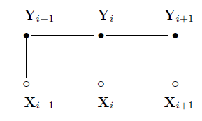

# clj-crfsuite

[](https://circleci.com/gh/onutech/clj-crfsuite)



Clojure interface to [CRFSuite](http://www.chokkan.org/software/crfsuite/) - a fast linear-chain CRF library.

This is a thin wrapper around [jcrfsuite](https://github.com/vinhkhuc/jcrfsuite/) so we can use clojure data structures.

## Usage

### Lein artifact

[](http://clojars.org/clj-crfsuite)

A linear chain CRF produces one symbol per output feature. For a simple task like POS-tagging:

```
NP --- conj --- NP --- VP --- dobj
|       |       |      |       |
|       |       |      |       |
John   and     mary   like    apples
```

The CRF is supplied english words (or some features corresponding to english words). The output is the POS tags.

### Training:

Args:

 * `xs` : A list of sequences. A sequence is a clojure sequence of feature-vectors or feature-maps (a map from feature -> value).
 * `ys` : Tags corresponding to sequences in xs.
 * `model-file` : Location to dump model to.

```clojure
user=> (train [
               [{:feat1 2.0, :feat2 3.0}
                {:feat1 3.0, :feat2 4.0}] ; the first sequence of features
			   [{:feat1 2.0, :feat2 3.0}
			    {:feat1 4.0, :feat2 5.0}] ; the second sequence of features
			   ]
		      [
			   ["y1", "y2"], ; tag-sequence
			   ["y1", "y3"]  ; tag-sequence
		       ]
		      "trainmodel.crfsuite") ; destination
.
.
.
L-BFGS resulted in convergence
Total seconds required for training: 0.000

Storing the model
user=>
```

You can also supply a vector of features (or an ndarray like `core.matrix` matrices):

```clojure
      (train [
              [
               [1.0, 2.0],
               [3.0, 4.0]
               ]
              [
               [1.0, 2.0],
               [3.0, 4.0]
               ]
              ]
             
             [["y3", "y4"]
              ["y3", "y4"]]

             "trainmodel.crfsuite")
```

### Tagging:

Pass a sequence of features to be tagger with a model stored in `traimodel.crfsuite`. Returns a
sequence of tag, probability pairs.

```clojure
user=> (tag [{:feat1 2.0, :feat2 3.0} {:feat1 3.0, :feat2 4.0}] "trainmodel.crfsuite")
[
  [{:tag "y1"} {:probability 0.43526113123400284}] ;; instances of type clj-crfsuite.core.Tag
  [{:tag "y3"} {:probability 0.36107961034023944}]
])
```


## License

Copyright © 2015 - 2016 Onu Technology, Inc.

Distributed under the Apache v2 License.
